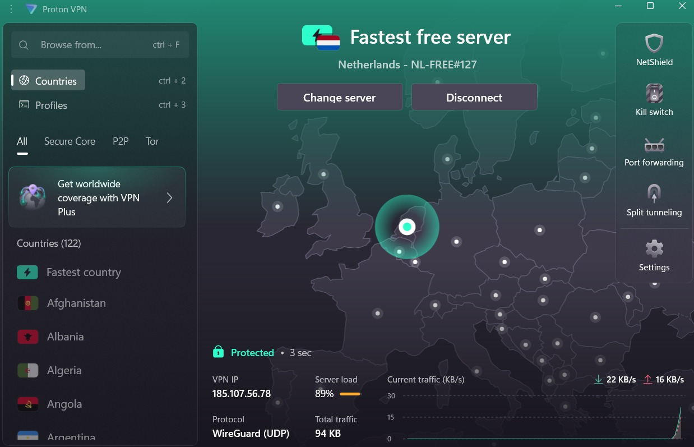
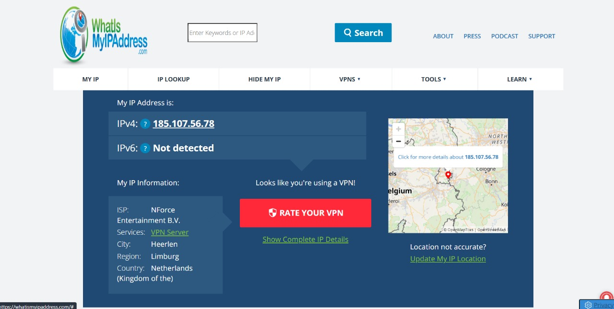

# 🔐 VPN Privacy & Secure Communication Report

## 📌 Objective
To understand the role of **VPNs (Virtual Private Networks)** in protecting privacy, ensuring secure communication, and masking IP addresses.  

---

## 🌍 What is a VPN?
A **Virtual Private Network (VPN)** is a service that encrypts internet traffic and routes it through a secure server, hiding your real IP address and location.  

- It creates a secure “tunnel” between your device and the internet.  
- Prevents hackers, ISPs, and third parties from tracking your online activity.  
- Helps access geo-restricted content by masking your IP.  

---

## ⚡ Why Do We Use a VPN?
- To protect sensitive data while browsing, especially on public Wi-Fi.  
- To keep browsing history private from ISPs and advertisers.  
- To bypass censorship and access restricted websites.  
- To secure communication from cyber-attacks such as **man-in-the-middle attacks**.  

---

## ⚙️ How Does a VPN Work?
1. The VPN client encrypts your data on your device.  
2. Encrypted traffic is sent to the VPN server.  
3. The server decrypts the data and forwards it to the destination website.  
4. The website sees the VPN server’s IP address, not your real IP.  
5. The response follows the same encrypted tunnel back to you.  

---

## 🛠️ Steps to Setup ProtonVPN (Free)
1. Sign up for a **free ProtonVPN account** at [ProtonVPN](https://protonvpn.com).  
2. Download and install the ProtonVPN client for your operating system.  
3. Login with your ProtonVPN credentials.  
4. Connect to a server (closest or fastest free server recommended).  
5. Verify IP address change using [whatismyipaddress.com](https://whatismyipaddress.com).  
6. Browse the internet securely with your new encrypted connection.  
7. Disconnect to compare browsing speed and IP.  

---

## 📸 Screenshots

### ✅ ProtonVPN Connected

### ✅ IP Address Changed

---

## 🔒 VPN Encryption & Privacy Features
- **Encryption Protocols:** WireGuard, OpenVPN, IKEv2/IPSec.  
- **Data Encryption:** AES-256 (military-grade).  
- **No-Logs Policy:** Reputable VPNs claim not to store user browsing activity.  
- **Extra Security:** Kill switch, DNS leak protection, split tunneling.  

---

## ✅ Benefits of VPN
- Hides real IP address & masks location.  
- Protects privacy against ISP and government monitoring.  
- Secures data on public Wi-Fi.  
- Prevents identity theft and online tracking.  
- Can bypass some geo-blocks.  

---

## ⚠️ Limitations of Free VPNs
- Limited server locations and bandwidth.  
- Slower speeds compared to premium VPNs.  
- Some free VPNs may log activity.  
- May not work with streaming services like Netflix.  

---

## 📝 Conclusion
VPNs play a crucial role in **cybersecurity and personal privacy**. By encrypting communication and masking IP addresses, they provide a strong layer of protection against surveillance, cyber-attacks, and data theft.  

Our test with **ProtonVPN (Free Tier)** successfully:  
- Changed our IP address (showing Netherlands).  
- Secured traffic using **WireGuard protocol**.  
- Demonstrated that browsing is encrypted and private.  

VPNs are an essential tool for anyone concerned about **online privacy and security**.

---
